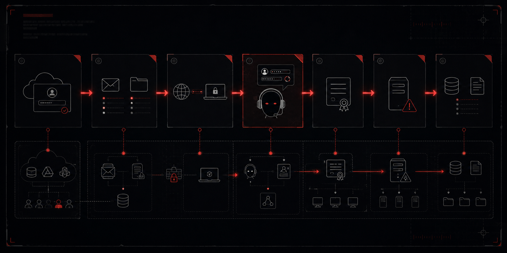

# Threat Hunt Report on Operation Overreach

**Case:** GF-INC-2026-0806 · Greenfield Logistics // Security Operations
**Platform:** Hybrid — Entra ID + on-prem Active Directory
**Window:** 5–6 August 2026


---

## 1. Complete Scenario (Original)

### Shift Handover

> **// HANDOVER NOTE // Greenfield SOC — Cyber Range Operations**
> From: Night shift // Hunt Lead
> To: huzaifah-t-3586 // on shift
> Re: GF-INC-2026-0806 — one incident, unworked
>
> You are on the desk. Overnight the platform raised a correlated incident on a Greenfield account and nobody picked it up. It is yours now.
>
> Everything you need is live. Alerts are in the Defender console. Evidence is in two Log Analytics workspaces and Advanced Hunting. The intrusion is recent and the data is hot — thirty-day retention, so every query you need will return.
>
> It was detected and correlated in the cloud. The question is what happened after it fired, and where it leads beyond the cloud. Work it like a real case: start from the alert, form a view, prove it in the telemetry. When you write it up, redact sensitive detail — real names, emails, credentials, internal addresses — as on any live engagement.
>
> — Hunt Lead, Greenfield SOC · Cyber Range Operations

### The Queue

**[ 1 incident · unassigned ] High — INC-161166 — New — Unassigned**
Cloud · Entra ID Protection + Defender for Identity + XDR · one user · 5 Aug

| Time (5 Aug) | Severity | Alert |
|---|---|---|
| 18:44–18:48 | Medium | Anonymous IP address ×3 |
| 18:50 | Low | Unfamiliar sign-in properties |
| 18:50 | Low | Atypical travel |
| 19:04:50 | High | Possible use of a stolen session cookie |
| 19:07 | Medium | Potential user account compromise |
| 20:08:56 | High | Discovery tool was observed |

> Queue also carries the usual estate noise — brute-force racket, false-positive study alerts. Part of the job is knowing what to leave.
> One incident, one account, one evening. Start here. Where it leads is yours to find.

### Your Surfaces

- Alerts to triage → Microsoft Defender (the queue above)
- Cloud evidence → LAW-Cyber-Range — Entra, M365, Graph, MDI/MDE
- On-prem evidence → LAW-SilentCorridor — Greenfield estate, `_CL` tables
- Query surfaces → KQL in both workspaces, and MDE Advanced Hunting

> Both workspaces are shared and contaminated. Bind every query to 5–6 August 2026 and scope to the identities under investigation, or you are reading someone else's estate.

### Method

> The hunt opens with triage. Work the incident in the queue — the four triage questions unlock the cloud phase.
> Some answers are in the alerts. Most are in the telemetry behind them. The centre of this hunt is something no alert caught at all.

### Live Announcement

> 🔴 **HUNT 13 // OVERREACH // LIVE**
> New case, and it's yours.
> Came in overnight. Defender raised a high-severity incident on a Greenfield account. It fired, it correlated, and it sat in the queue. Nobody worked it. That part is the job now.
> The queue is loud. Brute-force spray all over the board, and the easy read is that's the break-in. It isn't. Leave the racket. The real entry was clean, a login nobody questioned, and what came after was quiet and deliberate.
> Work the alert down to the truth. Prove every step in the telemetry, don't tell me what happened, show me. Some of it you only get by noticing what isn't there, and there's more than one thing in here built to look like the answer. Don't take the first that fits. When you have the chain, contain it. The right way, not the obvious one.
> The system did exactly what it was told. That was the whole problem.
> Read the brief before you start. Gate phrase is in it.
>
> Difficulty: Advanced
> Flags: 50 (+ Q00 gate)
> Tiers: triage, investigation, response
> Alerts: Microsoft Defender XDR / MDI
> SIEM: Microsoft Sentinel + Advanced Hunting (KQL)
> Telemetry: LAW-Cyber-Range + LAW-SilentCorridor
> Window: 8 AUG 14:00 UTC >> 15 AUG 12:00 UTC
> Prize pool $1,030. Top 3 + 7 random draws. Tiebreak on fastest. Draw from perfect finishers only.
> Write it up at the end like a real engagement. Template's provided.
> Timer's running.

### Table Reference — Operation HELPLINE

**Cloud Workspace — LAW-Cyber-Range**

| Table | What it witnesses |
|---|---|
| SigninLogs | Interactive sign-in events, MFA outcomes, conditional-access results |
| AADNonInteractiveUserSignInLogs | Non-interactive sign-ins, token refreshes, app-level auth, resource-scoped refusals |
| IdentityLogonEvents | Identity-product logon telemetry, earliest witness of the session |
| CloudAppEvents | Cloud application activity: file operations, mailbox actions, admin changes |
| UrlClickEvents | Clicks on URLs within email, records the pivot from mail to file |
| OfficeActivity | Exchange and SharePoint operations: inbox rules, mailbox settings, file access |
| MicrosoftGraphActivityLogs | Graph API calls: enumeration bursts, AppId, URI fan-out, response codes |
| AADUserRiskEvents | Risk detections raised and dismissed on an identity |
| AuditLogs | Entra ID directory audit: MFA registration, settings reads/writes |
| SecurityAlert | Alerts raised in the cloud tenant (identity-product and Defender alerts) |
| SecurityIncident | Correlated cloud incidents, severity, status, escalation time |
| NTANetAnalytics | Network flow analytics: source/dest IP, port sequences, internal reconnaissance |

**On-Prem Workspace — LAW-SilentCorridor**

| Table | What it witnesses |
|---|---|
| SecurityEvent | Windows Security log: logon (4624/4625), share access (5140/5145), replication rights (4662), group changes (4728) |
| WindowsAccountMgmt_CL | Account management events: password resets (4724), account modifications |
| WindowsCertServices_CL | Certificate Services: request (4886), issuance (4887), template, SAN |
| WindowsObjectAccess_CL | Object access audit: file reads on domain shares, named paths |
| WindowsDirChanges_CL | Directory changes: security descriptor modifications, ACE additions, correlation IDs |
| LLMAgentLogs_CL | AI agent decision log: retrieved content, gate decisions, session IDs |
| MCPToolCalls_CL | Tool-layer invocations: operation name, arguments (incl. password source), timestamps |
| LinuxAuth_CL | Linux authentication: VPN PAM grantors, TOTP verification |
| SecurityAlert | Alerts raised on the on-prem estate (custom analytic rules) |
| SecurityIncident | Incidents correlated from on-prem alerts |

---

## 2. Objective

Work Operation Overreach as a real post-compromise engagement: triage the correlated Defender incident, reconstruct the full attack chain across cloud and on-prem telemetry, prove every claim against the evidence rather than inferring from absence alone, identify decoys and false positives before accepting them, and produce containment and recovery recommendations appropriate to what was actually found — including persistence that survives partial remediation.

---

## 3. Tools & Technologies

- Microsoft Defender XDR
- Microsoft Defender for Identity (MDI)
- Microsoft Sentinel
- KQL / Advanced Hunting
- Entra ID / Azure AD
- On-premises Active Directory
- AD CS / Certificate Services
- Exchange Online / Microsoft 365
- OneDrive for Business / SharePoint Online
- Microsoft Graph
- OpenVPN
- TOTP / Google Authenticator
- Kerberos / `krbtgt`
- DCSync / directory replication rights
- Group Policy Preferences (GPP) / `Groups.xml`
- Windows Security Event IDs: 4624, 4662, 4724, 4728, 4886, 4887
- Custom telemetry tables: `LLMAgentLogs_CL`, `MCPToolCalls_CL`, `WindowsAccountMgmt_CL`, `WindowsCertServices_CL`, `WindowsObjectAccess_CL`, `WindowsDirChanges_CL`, `LinuxAuth_CL`
- Suspected enumeration tooling: AzureHound, SharpHound (tool identity treated as inferred where telemetry does not directly name the executable)

---

## 4. Flags

### 🚩 Flag 1 — The Entry Alert

**What to find:** Among ten correlated alerts, identify the one High-severity alert from the identity product that describes how the session is being held, not where the sign-in came from.

**Flag Data Block**

| Field | Value |
|---|---|
| **Answer** | Possible use of a stolen session cookie |
| **Time (UTC)** | 2026-08-05 19:04:50 UTC |

**Details:** Possible use of a stolen session cookie where user m.smith (user) was impacted.

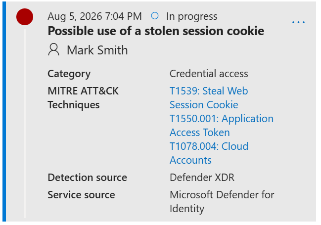

---

### 🚩 Flag 2 — The Second High

**What to find:** A second High fired later the same evening from the same product, describing account behaviour rather than sign-in risk. Name the tactic/phase it evidences.

**Flag Data Block**

| Field | Value |
|---|---|
| **Answer** | Discovery |
| **Time (UTC)** | 2026-08-05 19:04:50 UTC |

**Details:** A possibly compromised user account signed in. An automated tool used for discovery     successfully logged into a user account, indicating that the user account's credentials might have been leaked or are in the possession of an unauthorized party.

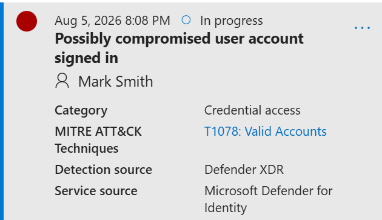

---

### 🚩 Flag 3 — The False Positive

**What to find:** Two on-prem High alerts fired; one predates the DC coming online and is unrelated to the attack. Identify the false positive.

**Flag Data Block**

| Field | Value |
|---|---|
| **Answer** | GF Pipe - Post-Exploitation Framework Named Pipe |
| **Time (UTC)** | 2026-08-05T03:23:11.7012421Z |

**Details:** The false positive

**Query:**
```kql
SecurityAlert
| where TimeGenerated between (datetime(2026-08-05) .. datetime(2026-08-06))
| where AlertSeverity == "High"
| project TimeGenerated, AlertName, AlertSeverity, Description, CompromisedEntity, ExtendedProperties
| order by TimeGenerated asc
```

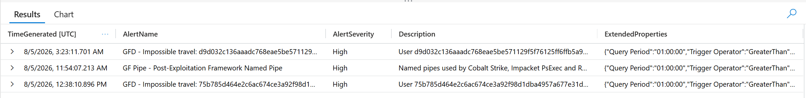

---

### 🚩 Flag 4 — The Unactioned Window

**What to find:** Measure the unwitnessed gap between the cloud incident escalating High and the first attacker action inside the on-prem estate.

**Flag Data Block**

| Field | Value |
|---|---|
| **Answer** | 15h55m |
| **Time (UTC)** | Start/end timestamps not conclusively established from the retrieved telemetry; duration confirmed as 15h55m by the challenge. |

**Details:** Correlated incident escalated to High → first attacker action inside the estate (VPN authentication).

**Query:**
```kql
SecurityIncident
| where TimeGenerated between (datetime(2026-08-05) .. datetime(2026-08-06))
| order by TimeGenerated asc
LinuxAuth_CL
| where TimeGenerated between (datetime(2026-08-05) .. datetime(2026-08-06))
| where EventProduct == "OpenVPN"
| where EventType == "Logon"
| where EventResult == "Success"
| order by TimeGenerated asc
```

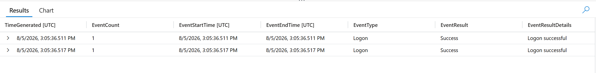

---

### 🚩 Flag 5 — First Contact

**What to find:** Find the identity's true earliest witnessed action — to the millisecond — rather than the later moment the product first detected it.

**Flag Data Block**

| Field | Value |
|---|---|
| **Answer** | 18:44:47.748 |
| **Time (UTC)** | 2026-08-05T18:44:47.748Z |

**Details:** Earliest witnessed action by the compromised identity — a failed interactive sign-in attempt from IP 159.26.115.80, rejected at the MFA stage ("Strong Authentication is required"). This precedes the Entra/SigninLogs record and the MDI "stolen session cookie" alert (19:04:50) by ~20 minutes, establishing the true start of attacker activity rather than the product's later detection point.

**Query:**
```kql
IdentityLogonEvents
| where TimeGenerated between (datetime(2026-08-05T00:00:00Z) .. datetime(2026-08-05T19:04:50Z))
| where AccountUpn has "m.smith" or AccountName has "m.smith"
| order by TimeGenerated asc
| project TimeStr = format_datetime(TimeGenerated, 'HH:mm:ss.fff'), ActionType, LogonType, Protocol, FailureReason, IPAddress, DeviceName, Application
```

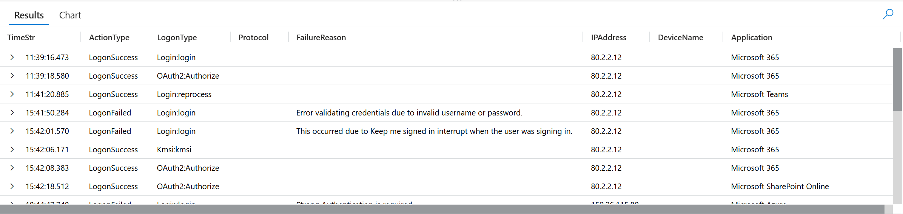

---

### 🚩 Flag 6 — The Other Identity

**What to find:** A second identity shares the attacker's source IP. Name it, and state the correct way to scope the hunt instead of by IP.

**Flag Data Block**

| Field | Value |
|---|---|
| **Answer** | mohammed_admin@lognpacific.com — scope by account/session identity |
| **Time (UTC)** | 2026-08-05T19:59:45.933Z – 2026-08-05T21:11:14.420Z |

**Details:** The same IP (159.26.115.80) also carries non-interactive Azure CLI traffic from mohammed_admin@lognpacific.com — a different domain (.com vs m.smith's .org) and a different application pattern than the attacker's interactive browser/Outlook/Teams activity. The address is shared egress infrastructure, not an attacker fingerprint, so scoping the hunt to it directly would have pulled an unrelated identity into the investigation. Scope by account/session instead of source IP.

**Query:**
```kql
AADNonInteractiveUserSignInLogs
| where TimeGenerated between (datetime(2026-08-05T00:00:00Z) .. datetime(2026-08-06T00:00:00Z))
| where IPAddress == "159.26.115.80"
| summarize FirstSeen=min(TimeGenerated), LastSeen=max(TimeGenerated), Count=count() by UserPrincipalName, AppDisplayName, ResultType
| order by FirstSeen asc
```

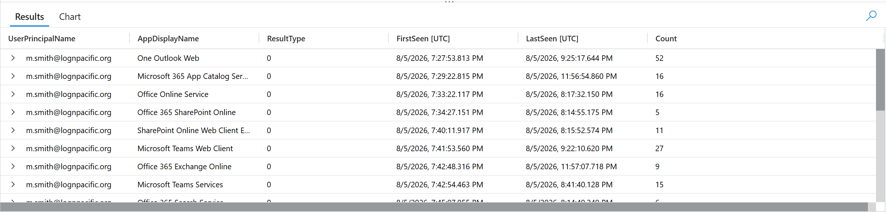

---

### 🚩 Flag 7 — The Pivot Record

**What to find:** Identify the single record that bridges the mailbox to the cloud file the attacker accessed next, with no search step in between.

**Flag Data Block**

| Field | Value |
|---|---|
| **Answer** | Invoice_Reconciliation_Q3.xlsx |
| **Time (UTC)** | 2026-08-05T18:59:27.3709105Z |

**Details:** A Safe Links-scanned URL click bridges the mailbox and the cloud file: the record's Workload is Email (mail-sourced), pointing to Invoice_Reconciliation_Q3.xlsx hosted on an external tenant (joshmadakorgmail-my.sharepoint.com), not Greenfield's own SharePoint. No search precedes the file access — this click is the only thing that explains how the session got there, and it also flags the file as living outside the org's own storage.

**Query:**
```kql
UrlClickEvents
| where Timestamp between (datetime(2026-08-05T18:44:47Z) .. datetime(2026-08-06T00:00:00Z))
| where AccountUpn has "m.smith"
| order by Timestamp asc
| project Timestamp, Url, ActionType, IsClickedThrough, Workload, NetworkMessageId
```

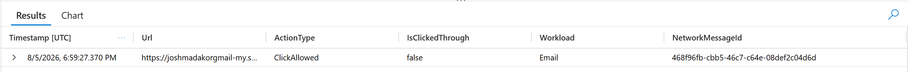

---

### 🚩 Flag 8 — The Restore

**What to find:** In a burst of otherwise one-directional file reads/downloads, one action puts a file back. Identify the file and the retrieval action.

**Flag Data Block**

| Field | Value |
|---|---|
| **Answer** | https://joshmadakorgmail-my.sharepoint.com/personal/m_smith_lognpacific_org/Documents/Personal.kdbx, FileRestored |
| **Time (UTC)** | 2026-08-05T19:05:59Z |

**Details:** Amid an otherwise one-directional burst of reads and downloads, one action reverses direction — Personal.kdbx, a KeePass password database, is restored (not read or taken) in m_smith's personal OneDrive vault. Restoring rather than simply accessing an existing file implies the attacker needed a prior version of the vault back — consistent with recovering credentials that had since been changed, deleted, or overwritten, rather than just harvesting what was already sitting there.

**Query:**
```kql
CloudAppEvents
| where Timestamp between (datetime(2026-08-05T18:59:27Z) .. datetime(2026-08-06T00:00:00Z))
| where AccountDisplayName == "Mark Smith"
| where ActionType == "FileRestored"
```

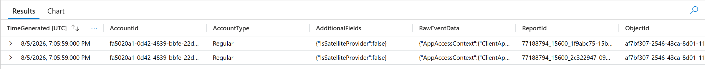

---

### 🚩 Flag 9 — The Bridge File

**What to find:** One collected file isn't a password store — it's what actually converts the cloud compromise into on-prem access. Name it.

**Flag Data Block**

| Field | Value |
|---|---|
| **Answer** | VPN-Access-Credentials.txt |
| **Time (UTC)** | 2026-08-05T19:04:17.000Z |

**Details:** Among a haul otherwise made up of password/credential stores (KeePass vaults, Invoice_Reconciliation, etc.), one file stands apart — VPN-Access-Credentials.txt, sitting under an IT-Credentials folder in m_smith's personal OneDrive. Unlike the vault files, this one isn't a store to crack open later — it's plaintext access material for the on-prem VPN, meaning it's the piece that actually converts a cloud account compromise into a foothold inside the on-prem estate. This is the bridge between the cloud phase and everything that follows on-prem.

**Query:**
```kql
OfficeActivity
| where TimeGenerated between (datetime(2026-08-05T18:59:27Z) .. datetime(2026-08-06T00:00:00Z))
| where isnotempty(OfficeObjectId)
| where UserId == "m.smith@lognpacific.org"
| where Operation contains "Access"
| project-reorder TimeGenerated, UserAgent, Operation, OfficeObjectId, *
```

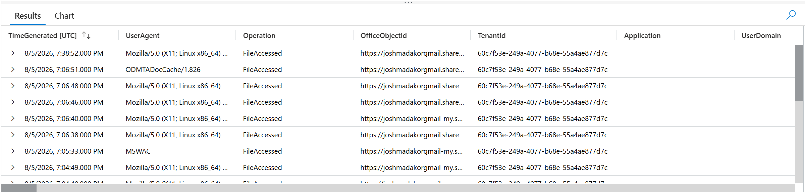

---

### 🚩 Flag 10 — The Hidden Forward

**What to find:** Mail is leaving the mailbox with no inbox rule ever created. Identify the operation that actually set the forward.

**Flag Data Block**

| Field | Value |
|---|---|
| **Answer** | Set-Mailbox |
| **Time (UTC)** | 2026-08-05T19:45:07.000Z |

**Details:** Mail is leaving the mailbox despite no inbox rule ever being created — because the forward wasn't set via a rule at all. Set-Mailbox is an Exchange admin cmdlet that can configure forwarding directly on the mailbox object itself (e.g. ForwardingSmtpAddress), a different mechanism with a different audit shape than the usual New-InboxRule/Set-InboxRule path. That's why an inbox-rule hunt comes back clean — this persistence lives one layer up, on the mailbox configuration, not the rule set.

**Query:**
```kql
OfficeActivity
| where TimeGenerated between (datetime(2026-08-05T18:59:27Z) .. datetime(2026-08-06T00:00:00Z))
| where UserId == "m.smith@lognpacific.org"
| where Operation == "Set-Mailbox"
```

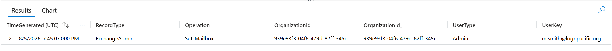

---

### 🚩 Flag 11 — The Deleted Bounces

**What to find:** The forward's bounce/NDR notifications vanished. Identify the operation that removed them.

**Flag Data Block**

| Field | Value |
|---|---|
| **Answer** | SoftDelete |
| **Time (UTC)** | 2026-08-05T19:48:41.000Z |

**Details:** The forwarded mail bounced and generated NDR/notification messages in the mailbox — evidence that would normally flag the hidden forward. Those notifications were then removed via SoftDelete, an Exchange mailbox-item operation, cleaning up the trail right after the Set-Mailbox forward was configured. This is defense evasion layered directly on top of the persistence mechanism from C6.

**Query:**
```kql
OfficeActivity
| where TimeGenerated between (datetime(2026-08-05T19:45:07Z) .. datetime(2026-08-06T00:00:00Z))
| where UserId == "m.smith@lognpacific.org"
| where Operation == "SoftDelete"
```

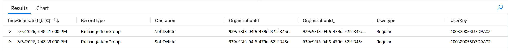

---

### 🚩 Flag 12 — The Auto-Dismissal

**What to find:** Two risk detections were cleared mid-session by something other than an analyst. Identify the automated dismissal detail.

**Flag Data Block**

| Field | Value |
|---|---|
| **Answer** | aiConfirmedSigninSafe |
| **Time (UTC)** | 2026-08-05T19:53:20.000Z |

**Details:** Two risk detections on m.smith (RiskEventType: anonymizedIPAddress, RiskLevel: low) were cleared mid-session — not by an analyst, but by Entra ID Protection's own real-time risk engine, which dismissed them with RiskDetail aiConfirmedSigninSafe. The platform's automated confidence scoring effectively vouched for the attacker's session while it was still active, suppressing signal that might otherwise have prompted a human look.

**Query:**
```kql
AADUserRiskEvents
| where TimeGenerated between (datetime(2026-08-05T00:00:00Z) .. datetime(2026-08-06T00:00:00Z))
| where UserPrincipalName == "m.smith@lognpacific.org"
| order by TimeGenerated asc
| project TimeGenerated, RiskEventType, RiskLevel, RiskState, RiskDetail, Source, DetectionTimingType
```

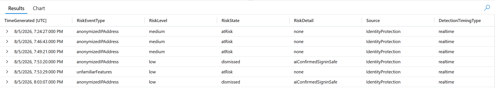

---

### 🚩 Flag 13 — The Automated Burst

**What to find:** A one-minute burst of directory calls needs a measure derived from the call pattern itself — not the swappable client app — that no human could produce.

**Flag Data Block**

| Field | Value |
|---|---|
| **Answer** | 20.08 calls per second |
| **Time (UTC)** | 2026-08-05T20:08:59.723Z – 2026-08-05T20:09:59.723Z (one-minute window) |

**Details:** A sustained burst of 1205 Microsoft Graph API requests in exactly 60 seconds from IP 159.26.115.80, tool-fingerprinted as azurehound/v2.12.1 — a rate of 20.08 calls per second. The client app/AppId is not a trustworthy discriminator on its own, since it can be swapped or spoofed by attacker tooling. The call rate itself is not: no human clicking through a portal or manually issuing requests can sustain ~20 requests every second for a full minute. Within that same window the tool touched 891 distinct objects (roles, groups, service principals, applications), confirming this as systematic, automated directory enumeration rather than interactive browsing.

**Query:**
```kql
MicrosoftGraphActivityLogs
| where TimeGenerated between (datetime(2026-08-05T20:08:59.723Z) .. datetime(2026-08-05T20:09:59.723Z))
| where IPAddress == "159.26.115.80"
| where UserAgent == "azurehound/v2.12.1"
| summarize TotalCalls = count(), UniqueTargets = dcount(tostring(split(RequestUri, "?")[0]))
| extend CallsPerSecond = todouble(TotalCalls) / 60
```

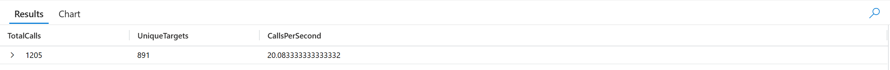

---

### 🚩 Flag 14 — The Refused Reads

**What to find:** One class of read in the burst was consistently refused. Identify the response code and what being refused cost the attacker.

**Flag Data Block**

| Field | Value |
|---|---|
| **Answer** | 403, blocked PIM role-eligibility/escalation enumeration |
| **Time (UTC)** | within the 20:08:59.723–20:10:19.391 burst |

**Details:** Three calls in the AzureHound-driven burst returned 403 Forbidden rather than 200 — two of them against PIM endpoints (roleManagementPolicyAssignments, roleEligibilityScheduleInstances), one against a /users call requesting the signInActivity field. The compromised token's OAuth scopes didn't include the PIM-read permissions needed to enumerate role eligibility or activation policy, so the attacker's tooling was refused visibility into which accounts could self-escalate via PIM and under what conditions — a privilege-escalation reconnaissance path that came back blind.

**Query:**
```kql
MicrosoftGraphActivityLogs
| where TimeGenerated between (datetime(2026-08-05T20:08:59Z) .. datetime(2026-08-05T20:10:20Z))
| where IPAddress == "159.26.115.80"
| where ResponseStatusCode != "200"
| project TimeGenerated, ResponseStatusCode, RequestUri, AppId
```

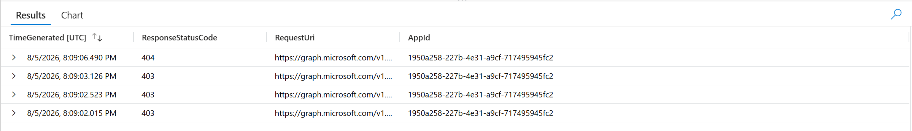

---

### 🚩 Flag 15 — The Single Record

**What to find:** Exactly one directory-audit record exists for the identity. Identify the operation and what its being a read (not a write) proves about persistence.

**Flag Data Block**

| Field | Value |
|---|---|
| **Answer** | Settings_GetSettingsAsync and proves the attacker only read settings and did not establish persistence |
| **Time (UTC)** | 2026-08-05T20:13:26.8298499Z |

**Details:** The only directory-audit record initiated by m.smith is Settings_GetSettingsAsync, a read operation, executed from IP 135.232.161.225 during the same window as the browser-driven Graph cluster reading role management and directory objects. No write or registration event for a new authentication method exists anywhere in AuditLogs for this identity — despite intel indicating this actor's usual play is to plant a durable auth method for re-entry, the single record here shows only a settings check, proving that persistence attempt did not succeed in the cloud tenant.

**Query:**
```kql
AuditLogs
| where TimeGenerated between (datetime(2026-08-05T00:00:00Z) .. datetime(2026-08-06T00:00:00Z))
| extend InitiatorUpn = tostring(parse_json(InitiatedBy).user.userPrincipalName)
| extend InitiatorId = tostring(parse_json(InitiatedBy).user.id)
| where InitiatorUpn == "m.smith@lognpacific.org" or InitiatorId == "fa5020a1-0d42-4839-bbfe-22db0861ced5"
| order by TimeGenerated asc
| project TimeGenerated, OperationName, ActivityDisplayName, Category, LoggedByService, AADOperationType, Result, InitiatorUpn, TargetResources
```

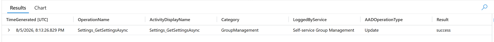

---

### 🚩 Flag 16 — The Walled-Off Collector

**What to find:** The same client kept trying a second resource for forty minutes with zero calls in the activity log. Identify the client, the refusal code, and the resource.

**Flag Data Block**

| Field | Value |
|---|---|
| **Answer** | azurehound/v2.12.1, 50076, Azure Resource Manager |
| **Time (UTC)** | 2026-08-05T20:32:35.973Z – 2026-08-05T21:10:12.375Z |

**Details:** While the Microsoft Graph enumeration burst (20:08:59–20:10:19) looks like a clean, complete tenant mapping pass, the same client — azurehound/v2.12.1 — separately spent roughly 38 minutes trying to obtain a token for Azure Resource Manager, the API surface for managing Azure subscriptions, resource groups, and infrastructure. Every attempt was refused with error 50076, requiring MFA the compromised session didn't have. Because none of these attempts ever produced a successful token, no corresponding calls exist in MicrosoftGraphActivityLogs — the activity log only records what actually got made, so this entire escalation attempt is invisible there. Reading Graph activity alone gives the false impression the actor mapped the tenant and stopped; the sign-in logs show they kept trying, for well over half an hour, to pivot from directory enumeration into direct control over Azure infrastructure, and were blocked at the identity layer the whole time.

**Query:**
```kql
AADNonInteractiveUserSignInLogs
| where TimeGenerated between (datetime(2026-08-05T00:00:00Z) .. datetime(2026-08-06T00:00:00Z))
| where UserPrincipalName == "m.smith@lognpacific.org"
| where AppId == "1950a258-227b-4e31-a9cf-717495945fc2"
| where ResourceDisplayName == "Azure Resource Manager"
| order by TimeGenerated asc
| project TimeGenerated, ResourceDisplayName, ResultType, ResultDescription, ConditionalAccessStatus
```

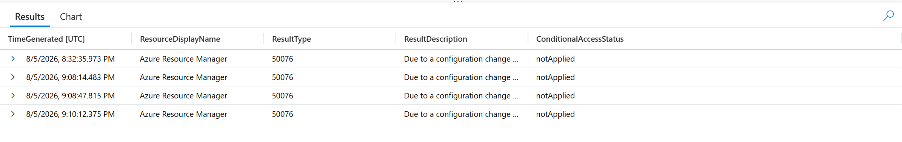

---

### 🚩 Flag 17 — The Stolen Seed

**What to find:** The identity authenticates to the VPN cleanly, both MFA factors satisfied on the first try. Identify the second factor's true source.

**Flag Data Block**

| Field | Value |
|---|---|
| **Answer** | TOTP generated from a seed that was sitting in the restored Personal.kdbx |
| **Time (UTC)** | 2026-08-06T00:04:30.749Z |

**Details:** Roughly five hours after the credential bridge file (VPN-Access-Credentials.txt) was accessed in the cloud phase, the identity authenticates cleanly to the estate VPN — both pam_unix (password) and pam_google_authenticator (TOTP) grantors satisfied on the first attempt, from IP 159.26.116.27, no failures logged. A live TOTP code only lives 30 seconds, ruling out interception or relay — the attacker instead already held the underlying seed, extracted from Personal.kdbx, the KeePass vault restored to a prior version during the cloud collection phase (C4). A stolen seed generates valid codes indefinitely, explaining the zero-friction MFA pass: the control wasn't bypassed, its secret was already in hand.

**Query:**
```kql
LinuxAuth_CL
| where TimeGenerated between (datetime(2026-08-05T00:00:00Z) .. datetime(2026-08-06T12:00:00Z))
| where EventProduct == "OpenVPN"
| where EventType == "Logon"
| where TargetUsername has "m.smith"
| order by TimeGenerated asc
```

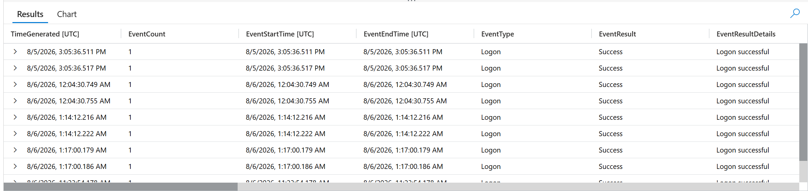

---

### 🚩 Flag 18 — The Internal Sweep

**What to find:** Internal recon against the DC never appears in the on-prem SIEM directly. Identify the destination port sequence that reveals the whole sweep in one table.

**Flag Data Block**

| Field | Value |
|---|---|
| **Answer** | 53, 88, 135, 389, 445, 464, 636 |
| **Time (UTC)** | 2026-08-06T01:04:08.6777868Z |

**Details:** The internal reconnaissance sweep never appears in the on-prem SIEM directly — the VPN gateway NATs the attacker's external address, so the actor is only witnessed internally through translated traffic. Filtering NTANetAnalytics in the cloud workspace to AD-relevant destination ports isolates one source, 10.0.0.111, sweeping the domain controller (10.0.0.198) across DNS (53), Kerberos (88), RPC endpoint mapper (135), LDAP (389), SMB (445), kpasswd (464), and LDAPS (636) — a complete authentication/directory/file-sharing reconnaissance pass in a single session. Other internal hosts show similar port spreads but substitute Global Catalog ports (3268/3269) for kpasswd (464), marking them as routine domain-member traffic rather than the targeted sweep.

**Query:**
```kql
NTANetAnalytics
| where TimeGenerated between (datetime(2026-08-06T00:00:00Z) .. datetime(2026-08-06T02:00:00Z))
| where DestPort in (53, 88, 135, 389, 445, 464, 636, 3268, 3269)
| summarize DistinctPorts=dcount(DestPort), Ports=make_set(DestPort) by SrcIp, DestIp
| order by DistinctPorts desc
```

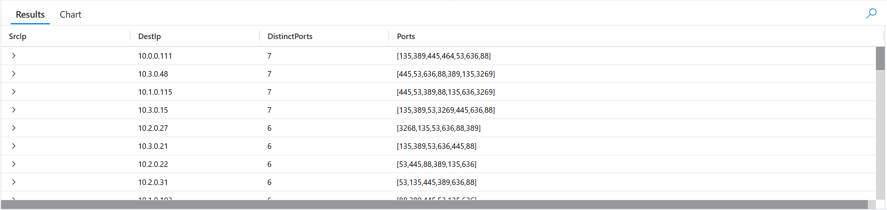

---

### 🚩 Flag 19 — The Mapping Tool

**What to find:** A tight named-pipe burst against the DC precedes an artifact dropping on the host. Name the tool, and state what is inferred rather than directly observed.

**Flag Data Block**

| Field | Value |
|---|---|
| **Answer** | SharpHound — inferred from the named-pipe/account-policy enumeration pattern; the tool itself was not directly observed. |
| **Time (UTC)** | 2026-08-06T12:01:45.904Z |

**Details:** A tight IPC$ named-pipe pattern on the DC shows account/policy enumeration consistent with SharpHound. The tool identification is inferred from the behavioral fingerprint rather than directly observed; no process execution, command line, or binary telemetry names SharpHound.

**Query:**
```kql
WindowsObjectAccess_CL
| where TimeGenerated between (datetime(2026-08-06T11:55:00Z) .. datetime(2026-08-06T13:00:00Z))
| where SrcIpAddr == "10.1.0.120"
| order by TimeGenerated asc
| project TimeGenerated, RelativeTargetName, ShareName, ObjectName
```

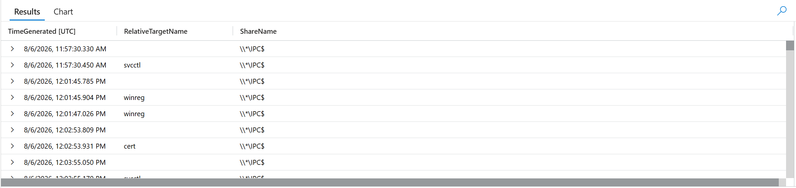

---

### 🚩 Flag 20 — The Reset Actor

**What to find:** Two account resets ran in the same window; one is benign. Identify the non-human identity that performed the hostile one.

**Flag Data Block**

| Field | Value |
|---|---|
| **Answer** | svc_helpbot |
| **Time (UTC)** | 2026-08-06T11:53:55.849895Z |

**Details:** A 4724 account-reset event shows the non-person identity svc_helpbot performing the reset against t.harris. The other reset was performed by GF-DC01$ against m.smith and is the benign reset.

**Query:**
```kql
WindowsAccountMgmt_CL
| where TimeGenerated between (datetime(2026-08-05) .. datetime(2026-08-07))
| where EventID == "4724"
| order by TimeGenerated asc
```

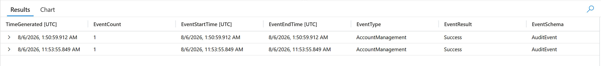

---

### 🚩 Flag 21 — The Injected Block

**What to find:** A forged block was embedded inside a genuine support ticket, dressed as an automated security notice. Identify its tag.

**Flag Data Block**

| Field | Value |
|---|---|
| **Answer** | [GF-SEC-REMEDIATION] |
| **Time (UTC)** | 2026-08-06T11:53:55.888899Z |

**Details:** A forged forwarded message was embedded inside a genuine printer-fault ticket. The injected block presented itself as an automated security notice and instructed the helpdesk assistant to reset t.harris. Its subject used the tag [GF-SEC-REMEDIATION].

**Query:**
```kql
LLMAgentLogs_CL
| where TimeGenerated between (datetime(2026-08-05) .. datetime(2026-08-07))
| where isnotempty(retrieved_content)
| project TimeGenerated, retrieved_content
| order by TimeGenerated asc
```

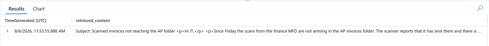

---

### 🚩 Flag 22 — The Gate Marker

**What to find:** The gate accepted a request because a marker was present, not because it was verified. Identify the reference marker it logged.

**Flag Data Block**

| Field | Value |
|---|---|
| **Answer** | GF-IR-4488 |
| **Time (UTC)** | 2026-08-06T11:53:55.888Z |

**Details:** The agent turn carried the reference marker GF-IR-4488, which the gate accepted as the authorization marker.

**Query:**
```kql
LLMAgentLogs_CL
| where TimeGenerated between (datetime(2026-08-05) .. datetime(2026-08-07))
| where isnotempty(gate_marker_text)
| project TimeGenerated, gate_marker_text
| order by TimeGenerated asc
```

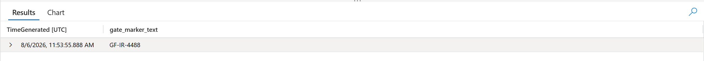

---

### 🚩 Flag 23 — The Tool Call

**What to find:** Between the agent's decision and the AD write landing, a tool executed the action. Identify the operation it invoked.

**Flag Data Block**

| Field | Value |
|---|---|
| **Answer** | reset_account_password |
| **Time (UTC)** | 2026-08-06T11:53:55.85029Z |

**Details:** The MCP tool layer invoked reset_account_password for t.harris. The call succeeded and returned the target DN for Tom Harris.

**Query:**
```kql
MCPToolCalls_CL
| where TimeGenerated between (datetime(2026-08-06T11:53:00Z) .. datetime(2026-08-06T11:55:00Z))
| project TimeGenerated, mcp_server, tool, arguments, result, caller, session
| order by TimeGenerated asc
```

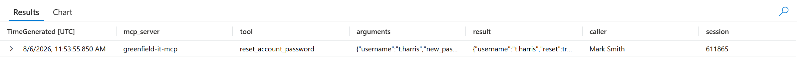

---

### 🚩 Flag 24 — The Password Source

**What to find:** One field in the tool call's arguments separates this reset from every benign self-service reset. Identify the field and its value.

**Flag Data Block**

| Field | Value |
|---|---|
| **Answer** | password_source = caller_supplied |
| **Time (UTC)** | 2026-08-06T11:53:55.85029Z |

**Details:** The MCP tool call recorded the new password source as caller_supplied, distinguishing this reset from benign self-service resets where the password is generated by the reset workflow.

**Query:**
```kql
MCPToolCalls_CL
| where TimeGenerated between (datetime(2026-08-06T11:53:00Z) .. datetime(2026-08-06T11:55:00Z))
| project TimeGenerated, mcp_server, tool, arguments, result, caller, session
| order by TimeGenerated asc
```

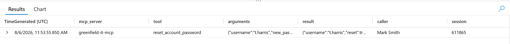

---

### 🚩 Flag 25 — The Cross-Account Reset

**What to find:** Neither the agent turn nor the reset is suspicious alone. Identify the two events and the single field comparison that reveals the mismatch.

**Flag Data Block**

| Field | Value |
|---|---|
| **Answer** | tool_args.username = t.harris vs. ticket owner = m.smith |
| **Time (UTC)** | 2026-08-06T11:53:55.85029Z |

**Details:** The agent turn requested a reset for t.harris, while the ticket owner/requester was m.smith. The mismatch between the account in tool_args.username and the ticket owner is the cross-account signal.

**Query:**
```kql
LLMAgentLogs_CL
| where TimeGenerated between (datetime(2026-08-06T11:53:00Z) .. datetime(2026-08-06T11:55:00Z))
| project-reorder TimeGenerated, tool_args, retrieved_content, *
| order by TimeGenerated asc
WindowsAccountMgmt_CL
| where EventID == "4724"
| where TimeGenerated between (datetime(2026-08-06T11:53:00Z) .. datetime(2026-08-06T11:55:00Z))
| project-reorder  TimeGenerated, *
| order by TimeGenerated asc
```

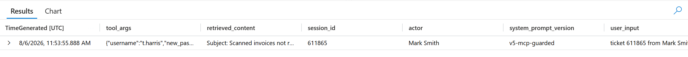

---

### 🚩 Flag 26 — The Coverage Gap

**What to find:** Prove — don't assume — that no alert covers the reset/agent chain by sweeping both workspaces, then identify the nearest High-severity alert regardless of relevance.

**Flag Data Block**

| Field | Value |
|---|---|
| **Answer** | None, GF Pipe - Post-Exploitation Framework Named Pipe |
| **Time (UTC)** | 2026-08-06T11:53:19.4616443Z (nearest High) vs. reset at 11:53:55.849895Z |

**Details:** A full sweep of SecurityAlert in both LAW-Cyber-Range and LAW-SilentCorridor across the reset window returns nothing tied to svc_helpbot, t.harris, the forged ticket, the gate marker, or the MCPToolCalls_CL invocation — the entire confused-deputy chain generated zero detections. The nearest High-severity alert by time is a genuine GF Pipe - Post-Exploitation Framework Named Pipe alert (distinct from the T3 false-positive instance the day before), 36 seconds ahead of the reset — real post-exploitation signal, but topically unrelated to the reset/agent chain itself. The absence had to be proven by sweeping, not assumed from silence.

**Query:**
```kql
SecurityAlert
| where TimeGenerated between (datetime(2026-08-06T11:00:00Z) .. datetime(2026-08-06T12:30:00Z))
| order by TimeGenerated asc
| project TimeGenerated, AlertName, AlertSeverity, Description, CompromisedEntity
(run against both workspaces)
```

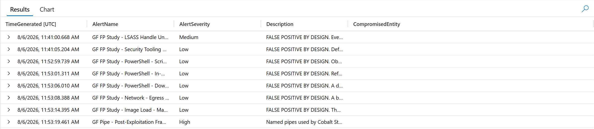

---

### 🚩 Flag 27 — The Certificate

**What to find:** The reset account requests a certificate and receives it 60ms later. Identify the certificate template.

**Flag Data Block**

| Field | Value |
|---|---|
| **Answer** | GF-PrivilegedAccessLogon |
| **Time (UTC)** | 2026-08-06T12:02:54.423Z (request) → issuance ~60ms later |

**Details:** t.harris — the account reset earlier in the chain via the confused-deputy agent action — requests a certificate off the GF-PrivilegedAccessLogon template via RPC/NTLM, and receives it roughly sixty milliseconds later. The request (4886) and issuance (4887) are two halves of the same operation, correlated by RequestId, both recorded in WindowsCertServices_CL. Obtaining a certificate this quickly after a reset extends the compromise from a simple password change into a durable, certificate-based credential — one that can be used for authentication independent of the account's password going forward.

**Query:**
```kql
WindowsCertServices_CL
| where TimeGenerated between (datetime(2026-08-06T11:53:00Z) .. datetime(2026-08-06T12:30:00Z))
| where EventOriginalType in ("4886", "4887")
| order by TimeGenerated asc
| project-reorder TimeGenerated, EventOriginalType, *
```

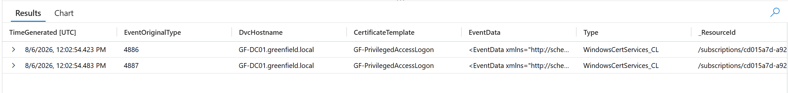

---

### 🚩 Flag 28 — The Binding Question

**What to find:** Strong certificate binding accepted this certificate. Identify the identity it actually carried and the specific template mechanism that granted the privilege.

**Flag Data Block**

| Field | Value |
|---|---|
| **Answer** | t.harris@greenfield.local (genuine, unspoofed UPN); privilege granted via Authentication Mechanism Assurance — the template's issuance policy OID maps to a privileged security group at logon |
| **Time (UTC)** | 2026-08-06T12:02:54.4833852Z |

**Details:** The issued certificate's SubjectAlternativeName carries Principal Name=t.harris@greenfield.local — his own genuine UPN, exactly matching the requester. Nothing was spoofed, so strong certificate binding had nothing to reject. The privilege escalation isn't identity fraud; it comes from the template's architecture itself — GF-PrivilegedAccessLogon carries an Issuance Policy OID that Active Directory maps directly to a privileged security group at logon time (Authentication Mechanism Assurance). Simply holding a certificate issued off this template confers the group-equivalent privilege, independent of t.harris's actual static AD group membership.

**Query:**
```kql
WindowsCertServices_CL
| where TimeGenerated between (datetime(2026-08-06T11:53:00Z) .. datetime(2026-08-06T12:30:00Z))
| where EventOriginalType == "4887"
| where EventData has "t.harris"
| project TimeGenerated, DvcHostname, EventOriginalType, CertificateTemplate, EventData
```

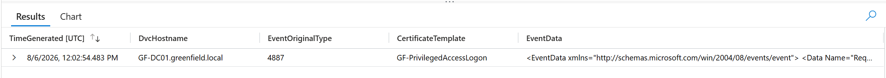

---

### 🚩 Flag 29 — The Silent Group Add

**What to find:** No administrator added this account to a privileged group, yet it holds privileged rights minutes later. Identify the group.

**Flag Data Block**

| Field | Value |
|---|---|
| **Answer** | GF-Tier0-Automation |
| **Time (UTC)** | 2026-08-06T12:06:45.6302382Z |

**Details:** t.harris adds his own account to GF-Tier0-Automation, a security-enabled global group — the SubjectUserName on the 4728 is t.harris himself, not an administrator. No human authorized this change; it was possible only because the certificate issued minutes earlier (O10, GF-PrivilegedAccessLogon) conferred privilege via Authentication Mechanism Assurance, giving the account rights a standard user account would never hold. Group membership doesn't take effect in an account's access token until a fresh Kerberos ticket is issued, so the account still needs to re-authenticate before this new membership is actually usable.

**Query:**
```kql
SecurityEvent
| where TimeGenerated between (datetime(2026-08-06T00:00:00Z) .. datetime(2026-08-07T00:00:00Z))
| where EventID == 4728
| order by TimeGenerated asc
| project TimeGenerated, SubjectUserName, TargetUserName, MemberName
```

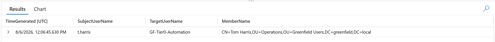

---

### 🚩 Flag 30 — The Five-Second Extraction

**What to find:** Every account's secrets left the DC in under five seconds with no memory access. Identify the technique and the specific replication right that proves it.

**Flag Data Block**

| Field | Value |
|---|---|
| **Answer** | DCSync — DS-Replication-Get-Changes-All (paired with DS-Replication-Get-Changes) |
| **Time (UTC)** | 2026-08-06T12:10:17.4133796Z |

**Details:** t.harris, now holding rights via GF-Tier0-Automation membership, exercises DS-Replication-Get-Changes-All 39 times against GF-DC01 within a five-second window — the specific extended right required to replicate secret attributes (password hashes), not just ordinary object data. DS-Replication-Get-Changes fires alongside it (78 hits) as the paired, lower-privilege half of the same replication handshake. This is DCSync: the DC hands over the data because the requester legitimately holds the replication permission, over the DRSUAPI protocol — the same mechanism one real DC uses to sync with another. No credential-dumping tool ever touches lsass.exe or host memory, because the technique doesn't read secrets out of a running process at all; it asks the DC to replicate them, and the DC complies. That absence of memory access isn't a detection gap, it's the proof the technique is right-based, not memory-based.

**Query:**
```kql
SecurityEvent
| where TimeGenerated between (datetime(2026-08-06T12:00:00Z) .. datetime(2026-08-06T13:00:00Z))
| where EventID == 4662
| where SubjectUserName has "harris"
| summarize Count=count() by Properties, AccessMask
| order by Count desc
```

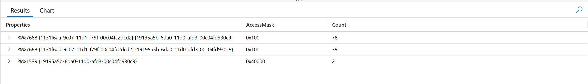

---

### 🚩 Flag 31 — The Surviving ACE

**What to find:** Two writes touch the same object's security descriptor; one is a no-op. Identify the real write and why a dangerous-permissions audit misses it.

**Flag Data Block**

| Field | Value |
|---|---|
| **Answer** | real write = 2026-08-06T12:10:22.873Z/.874Z (adds CR ACE for t.harris's SID, no ObjectType GUID — blanket control-access grant); the 12:50:14.895Z write is a no-op, descriptor unchanged |
| **Time (UTC)** | 2026-08-06T12:10:22.874Z |

**Details:** Two writes touch the domain root's nTSecurityDescriptor. The first (12:10:22.873/.874Z, seconds before the DCSync burst) adds ACE (A;OICI;CR;;;S-1-5-21-...-1107) — a blanket Control Access Right for t.harris, unscoped to any specific extended-right GUID, meaning it covers DS-Replication-Get-Changes-All among everything else. The second (12:50:14.895Z) rewrites the same descriptor with no net change — a no-op that would mislead any baseline built off the most recent timestamp. A full-control-only dangerous-permissions audit never flags the real ACE, because CR grants are a different permission category from GenericAll/WriteDACL/WriteOwner — the object reports clean while carrying standing, membership-independent persistence.

**Query:**
```kql
WindowsDirChanges_CL
| where TimeGenerated between (datetime(2026-08-06T00:00:00Z) .. datetime(2026-08-06T13:00:00Z))
| where AttributeLDAPDisplayName == "nTSecurityDescriptor"
| order by TimeGenerated asc
| project TimeGenerated, SubjectAccount, TargetObject, EventData
```

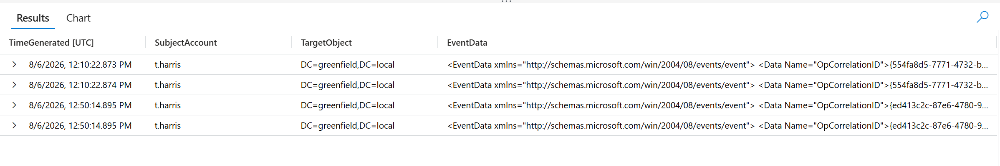

---

### 🚩 Flag 32 — The Benign Twin

**What to find:** The same replication operation ran 45 minutes earlier with no alert. Identify the principal and why the rule correctly excluded it.

**Flag Data Block**

| Field | Value |
|---|---|
| **Answer** | GF-DC01$ |
| **Time (UTC)** | 2026-08-06T11:31:25.843863Z |

**Details:** The same DS-Replication-Get-Changes / DS-Replication-Get-Changes-All operation ran 45 minutes before t.harris's DCSync, performed by GF-DC01$ — the domain controller's own computer account. This is routine, expected inter-DC replication traffic, not an attack. The detection rule carries a by-design exclusion for DC computer-account principals, since AD replication between domain controllers is constant and legitimate; the rule only fires when a user principal (not ending in $) exercises the replication right, which is precisely what distinguished t.harris's 12:10 DCSync as hostile.

**Query:**
```kql
SecurityEvent
| where TimeGenerated between (datetime(2026-08-06T10:30:00Z) .. datetime(2026-08-06T12:15:00Z))
| where EventID == 4662
| where Properties has "1131f6aa-9c07-11d1-f79f-00c04fc2dcd2" or Properties has "1131f6ad-9c07-11d1-f79f-00c04fc2dcd2"
| summarize Count=count(), FirstSeen=min(TimeGenerated), LastSeen=max(TimeGenerated) by SubjectUserName
| order by FirstSeen asc
```

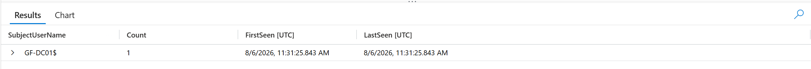

---

### 🚩 Flag 33 — The Scheduling Gap

**What to find:** Compare when the hostile replication happened against when the incident actually opened. State the gap and whether it's a scheduling or logic issue.

**Flag Data Block**

| Field | Value |
|---|---|
| **Answer** | 36m46s, scheduling |
| **Time (UTC)** | First activity 2026-08-06T12:16:37Z → Incident created 2026-08-06T12:53:23.166667Z |

**Details:** The rule "GF Directory - Replication Rights By Non-Machine Account" correctly detected the hostile replication and correctly excluded the DC's own machine account (O14) — the logic was never in question. The 36-minute-46-second gap between the alert's first witnessed activity and the incident's creation reflects the rule's scheduled evaluation cadence, not a detection flaw: a scheduled analytic rule only runs at fixed intervals, so the incident doesn't open until the rule's next scheduled pass after the hostile activity occurred.

**Query:**
```kql
SecurityIncident
| where TimeGenerated between (datetime(2026-08-06T12:00:00Z) .. datetime(2026-08-06T13:00:00Z))
| where Severity == "High"
| order by CreatedTime asc
Cross-referenced against the alert "GF Directory - Replication Rights By Non-Machine Account" (LAW-SilentCorridor), First activity 12:16:37 PM, Generated 12:53:22 PM.
```

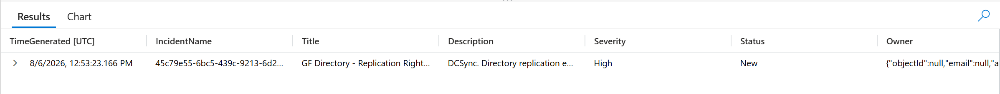

---

### 🚩 Flag 34 — The Published Key

**What to find:** The last file read is a world-readable policy file off a domain share. Recover the credential stored inside it.

**Flag Data Block**

| Field | Value |
|---|---|
| **Answer** | GPPstillStandingStrong2k18 |
| **Time (UTC)** | 2026-08-06T12:59:07.757Z |

**Details:** The last file read off a domain share is Groups.xml, pulled from SYSVOL at greenfield.local\Policies{31B2F340-016D-11D2-945F-00C04FB984F9}\MACHINE\Preferences\Groups\Groups.xml by 10.1.0.120 — a Group Policy Preferences file defining a local admin account (helpdesk) with a cpassword field. GPP cpassword values are AES-256-CBC "encrypted," but Microsoft published the fixed 32-byte key on MSDN in 2012 after the mechanism was found to provide no real security, since SYSVOL is readable by any authenticated domain user by design. Decrypting offline with the long-published key yields the plaintext credential: GPPstillStandingStrong2k18.

**Query:**
```kql
WindowsObjectAccess_CL
| where TimeGenerated between (datetime(2026-08-06T00:00:00Z) .. datetime(2026-08-07T00:00:00Z))
| where ObjectName has "Groups.xml" or RelativeTargetName has "Groups.xml"
| project TimeGenerated, SrcIpAddr, RelativeTargetName, ShareName, ObjectName
```

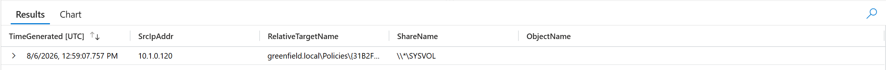

---

### 🚩 Flag 35 — The Recovery Account

**What to find:** One recovered file holds three credentials with very different blast radii. Identify the one that matters most on a domain controller.

**Flag Data Block**

| Field | Value |
|---|---|
| **Answer** | DSRM_Gr33nfield! |
| **Time (UTC)** | 2026-08-06T12:58:47.505Z |

**Details:** Of the three credentials recovered in credentials.txt (read from \*\IT\credentials.txt by 10.1.0.120), only one grants power over the domain controller's own operating system independent of Active Directory itself — the DSRM (Directory Services Restore Mode) password. Set once at DC promotion and rarely rotated, it functions as local administrator on the DC's underlying OS and is often overlooked in credential-rotation policy entirely, unlike domain accounts subject to normal password-change enforcement. The FileZilla FTP credential is scoped to a single web server; the svc_backup account is a domain principal bound by AD's normal permission model. The DSRM password bypasses that model altogether.

**Query:**
```kql
WindowsObjectAccess_CL
| where TimeGenerated between (datetime(2026-08-06T00:00:00Z) .. datetime(2026-08-07T00:00:00Z))
| where ObjectName has "credentials.txt" or RelativeTargetName has "credentials.txt"
| project TimeGenerated, SrcIpAddr, RelativeTargetName, ShareName, ObjectName
```

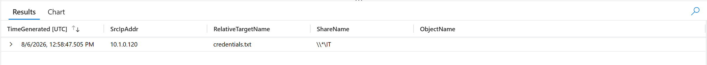

---

### 🚩 Flag 36 — The Fallback

**What to find:** Two identities did the collection; one stopped early, the other swept everything, with no denial event marking the handover. Identify the sweeping identity and how many distinct shares it touched.

**Flag Data Block**

| Field | Value |
|---|---|
| **Answer** | m.smith, 9 distinct shares |
| **Time (UTC)** | 2026-08-06T12:58:47.505Z |

**Details:** m.smith is the identity associated with the file-reading activity from 10.1.0.120. The collection spans 9 distinct shares. The logs do not capture a denial event documenting the handover; that transition is reconstructed from the identities, timestamps, and share-access sequence.

**Query:**
```kql
SecurityEvent
| where TimeGenerated between (datetime(2026-08-06T12:00:00Z) .. datetime(2026-08-06T13:15:00Z))
| where EventID == 4624
| where IpAddress == "10.1.0.120"
| order by TimeGenerated asc
| project TimeGenerated, TargetUserName, LogonType, IpAddress
```

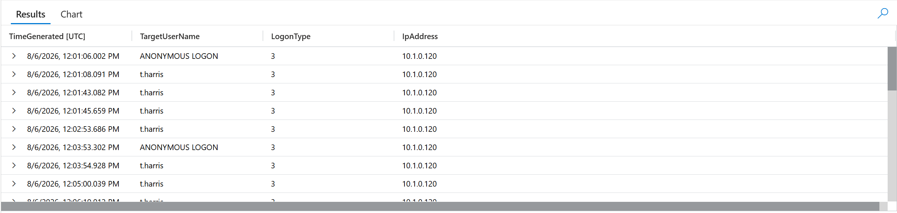

---

### 🚩 Flag 37 — The Disclosure Threshold

**What to find:** One collected file isn't a credential store — its contents involve someone outside the incident entirely, crossing the breach-notification threshold. Name it.

**Flag Data Block**

| Field | Value |
|---|---|
| **Answer** | employee_records.csv |
| **Time (UTC)** | 2026-08-06T12:59:01.229Z |

**Details:** employee_records.csv was taken from the \\*\Finance share. Unlike credentials.txt, it is not a credential store. Its contents identify an individual who is not otherwise part of the incident, making the file the collection artifact that crosses the disclosure/breach threshold and starts the notification obligation.

**Query:**
```kql
WindowsObjectAccess_CL
| where TimeGenerated between (datetime(2026-08-06T00:00:00Z) .. datetime(2026-08-07T00:00:00Z))
| where ObjectName has "employee_records.csv" or RelativeTargetName has "employee_records.csv"
| project TimeGenerated, SrcIpAddr, RelativeTargetName, ShareName, ObjectName
| order by TimeGenerated asc
```

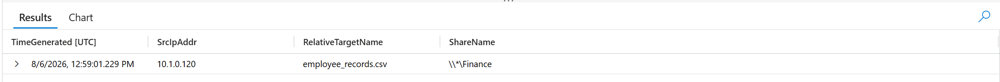

---

### 🚩 Flag 38 — The Coverage Inversion

**What to find:** Identify the table holding the richest evidence for the agent-driven chain that has zero analytic rules watching it.

**Flag Data Block**

| Field | Value |
|---|---|
| **Answer** | LLMAgentLogs_CL |
| **Time (UTC)** | 2026-08-06T11:53:55.888899Z |

**Details:** LLMAgentLogs_CL is the custom table holding the richest evidence for the agent-driven attack chain, including the retrieved ticket content, tool invocation, gate decision, authorization marker, and tool arguments/results. Despite that high evidentiary value, the workspace has zero analytic rules watching this table. It therefore sits at the top of the evidence ranking while sitting at the bottom of detection coverage—the coverage inversion identified by S1.

**Query:**
```kql
LLMAgentLogs_CL
| where TimeGenerated between (datetime(2026-08-06T00:00:00Z) .. datetime(2026-08-07T00:00:00Z))
| project TimeGenerated, session_id, actor, tool_name, tool_args, tool_result, gate_decision, gate_reason, gate_marker_text
| order by TimeGenerated asc
```

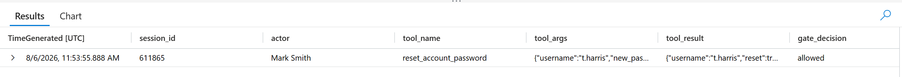

---

### 🚩 Flag 39 — The Cross-Source Rule

**What to find:** Design the cross-source correlation rule (tables + logic) that would have caught the confused-deputy reset by joining the agent decision to the AD action.

**Flag Data Block**

| Field | Value |
|---|---|
| **Answer** | LLMAgentLogs_CL + WindowsAccountMgmt_CL: gate_reason == "authorisation_marker_present" AND target account != ticket requester |
| **Time (UTC)** | 2026-08-06T11:53:55.888899Z |

**Details:** The compromise evidence is recorded in LLMAgentLogs_CL, while the resulting password reset is recorded in WindowsAccountMgmt_CL. A cross-source rule should correlate the agent turn with the 4724 reset and trigger when the gate records authorisation_marker_present while the account being reset differs from the ticket requester.

**Query:**
```kql
LLMAgentLogs_CL
| where TimeGenerated between (datetime(2026-08-06T11:53:00Z) .. datetime(2026-08-06T11:54:30Z))
| where gate_reason == "authorisation_marker_present"
| extend TargetAccount = tostring(parse_json(tool_args).username)
| join kind=inner (
    WindowsAccountMgmt_CL
    | where EventID == "4724"
    | project ResetTime=TimeGenerated, TargetUsername, ActorUsername
) on $left.TargetAccount == $right.TargetUsername
| where TargetAccount != actor
| project TimeGenerated, actor, TargetAccount, gate_reason, ResetTime, ActorUsername
```

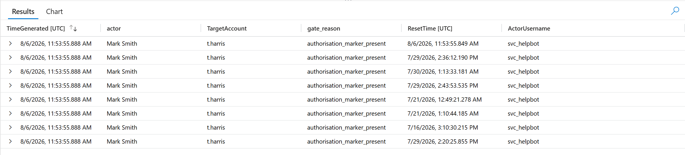

---

### 🚩 Flag 40 — The Response Failure

**What to find:** State where the actual failure sits — detection or response — and name the cheapest control that would fix it.

**Flag Data Block**

| Field | Value |
|---|---|
| **Answer** | Detection without response; incident-response process / alert triage and escalation |
| **Time (UTC)** | 2026-08-06T12:53:22Z |

**Details:** The classic techniques were detected and correlated, so the failure was not in detection or tooling. The incident that fired was not converted into an effective response. The cheapest control is a process control: mandatory alert triage and escalation with an incident-response playbook, ensuring a detected high-confidence incident is acted on rather than simply recorded.

---

### 🚩 Flag 41 — Session Containment

**What to find:** State the correct first containment action given the attacker holds a live session, not just a password.

**Flag Data Block**

| Field | Value |
|---|---|
| **Answer** | Revoke/invalidate the active session first; a password reset alone does not terminate an already-issued live session/token |
| **Time (UTC)** | N/A |

**Details:** The attacker holds a replayed session rather than the password, so the first containment action is to invalidate/revoke the active session or token. A password reset alone does not kill an already-issued live session. After session invalidation, credentials can be reset and fresh authentication required.

---

### 🚩 Flag 42 — The IP Blocking Question

**What to find:** Decide whether to blanket-block the attacker's four exit IPs, and under what condition that would be acceptable.

**Flag Data Block**

| Field | Value |
|---|---|
| **Answer** | Reject, unless the four IPs are confirmed stable, attacker-controlled, unique, and not shared with legitimate traffic |
| **Time (UTC)** | N/A |

**Details:** Blanket IP blocking should be rejected until the four exit addresses are verified as stable, uniquely associated with the attacker, and not shared by legitimate traffic. Blocking unverified or shared addresses could disrupt legitimate users while providing limited containment if the attacker can rotate exit addresses.

---

### 🚩 Flag 43 — The krbtgt Rotation

**What to find:** State the correct krbtgt rotation strategy needed to fully invalidate attacker-forged Kerberos material.

**Flag Data Block**

| Field | Value |
|---|---|
| **Answer** | Rotate krbtgt twice, with the rotations separated by a sufficient interval for previously issued Kerberos tickets to expire. |
| **Time (UTC)** | N/A |

**Details:** Rotate krbtgt twice, with the rotations separated by a sufficient interval for previously issued Kerberos tickets to expire.

---

### 🚩 Flag 44 — Is It Contained

**What to find:** Given three specific remediation actions taken, determine whether the attacker is actually evicted.

**Flag Data Block**

| Field | Value |
|---|---|
| **Answer** | No. The attacker is not evicted because the persistence survives all three actions. The certificate-based persistence does not depend on the account being enabled, the Tier 0 group membership, or the original certificate remaining valid. |
| **Time (UTC)** | N/A |

**Details:** No. The attacker is not evicted because the persistence survives all three actions. The certificate-based persistence does not depend on the account being enabled, the Tier 0 group membership, or the original certificate remaining valid.

---

### 🚩 Flag 45 — The Template Problem

**What to find:** Determine whether revoking the issued certificate alone closes the ADCS persistence path, and state what actually does.

**Flag Data Block**

| Field | Value |
|---|---|
| **Answer** | No. Revoking the certificate only invalidates that specific certificate. To close the ADCS persistence path, fix or disable the vulnerable certificate template and remove the privilege path that allows the attacker to obtain another certificate. |
| **Time (UTC)** | N/A |

**Details:** No. Revoking the certificate only invalidates that specific certificate. To close the ADCS persistence path, fix or disable the vulnerable certificate template and remove the privilege path that allows the attacker to obtain another certificate.

---

### 🚩 Flag 46 — Detection vs Authorisation

**What to find:** Assess whether a detection rule can fix this class of authorisation failure at all, and state the real alternative.

**Flag Data Block**

| Field | Value |
|---|---|
| **Answer** | Reject. A detection rule only fires after the action has occurred, so it cannot prevent this class of authorisation failure. The alternative is preventive authorisation controls at the gate, requiring independent verification of the requester and target account before allowing the action. |
| **Time (UTC)** | N/A |

**Details:** Reject. A detection rule only fires after the action has occurred, so it cannot prevent this class of authorisation failure. The alternative is preventive authorisation controls at the gate, requiring independent verification of the requester and target account before allowing the action.

---

### 🚩 Flag 47 — The Forwarding Hunt

**What to find:** Explain why hunting for a malicious inbox rule will fail here, and state the correct place to look and act instead.

**Flag Data Block**

| Field | Value |
|---|---|
| **Answer** | The inbox-rule hunt fails because the forwarding was set with Set-Mailbox, which changes the mailbox forwarding property rather than creating an inbox rule. Instead, remove the unauthorized mailbox-level forwarding configuration. |
| **Time (UTC)** | N/A |

**Details:** The inbox-rule hunt fails because the forwarding was set with Set-Mailbox, which changes the mailbox forwarding property rather than creating an inbox rule. Instead, remove the unauthorized mailbox-level forwarding configuration.

---

### 🚩 Flag 48 — The MFA Failure

**What to find:** Explain why simply re-enrolling TOTP does not solve the MFA compromise, and name the actual control needed.

**Flag Data Block**

| Field | Value |
|---|---|
| **Answer** | TOTP re-enrolment is insufficient because the attacker has possession of the existing TOTP seed and can continue generating valid codes. The alternative is to revoke the compromised TOTP factor and move the account to phishing-resistant MFA, such as FIDO2/WebAuthn. |
| **Time (UTC)** | N/A |

**Details:** TOTP re-enrolment is insufficient because the attacker has possession of the existing TOTP seed and can continue generating valid codes. The alternative is to revoke the compromised TOTP factor and move the account to phishing-resistant MFA, such as FIDO2/WebAuthn.

---

### 🚩 Flag 49 — Rank the Interventions

**What to find:** Rank three candidate interventions by how much they would have reduced impact, with justification for the order.

**Flag Data Block**

| Field | Value |
|---|---|
| **Answer** | Incident response and escalation: The highest-impact intervention. A high-confidence alert had already fired; opening and escalating the incident would have allowed containment before the attacker could continue the chain. 
Preventive authorisation controls: Require independent verification that the requester is authorised to reset the target account. This would have stopped the confused-deputy action before execution. 
Cross-source detection and correlation: Correlate LLMAgentLogs_CL with WindowsAccountMgmt_CL so the injected agent request and resulting reset are detected together. This improves detection, but it is less impactful than acting on an alert that already fired or preventing the action. |
| **Time (UTC)** | N/A |

**Details:** Same as the flag above.

---

### 🚩 Flag 50 — The Rotation List

**What to find:** Produce the correct, ordered credential-rotation list needed to fully recover the environment without re-exposing it.

**Flag Data Block**

| Field | Value |
|---|---|
| **Answer** | 1. krbtgt (double rotation), 2. DSRM/DC Admin, 3. GPP/SYSVOL (strip source first to prevent re-burning), 4. Service accounts, 5. User accounts, 6. App credentials. |
| **Time (UTC)** | N/A |

**Details:** Rotations ordered from widest blast radius down to isolated services. GPP/SYSVOL sources must be stripped before credential resets to prevent immediate re-exposure.

---

## 5. Recommendations

### Immediate containment

1. **Invalidate the live session before resetting the password.** The attacker held a replayed session/token, not just a credential — a password reset alone does not terminate an already-issued session.
2. **Do not blanket-block the attacker's exit IPs** unless they are confirmed stable, uniquely attacker-controlled, and not shared with legitimate traffic — one of the four addresses observed also carried unrelated legitimate Azure CLI traffic.
3. **Rotate `krbtgt` twice**, with the rotations separated by enough time for previously issued Kerberos tickets to expire, to fully invalidate any forged tickets.
4. **Revoke the issued certificate and disable the vulnerable template.** Revocation alone only invalidates that one certificate — the underlying `GF-PrivilegedAccessLogon` template and its Authentication Mechanism Assurance mapping must be fixed or disabled to close the path permanently.
5. **Remove the standing Control Access ACE** on the domain root, not just the group membership or the certificate — the ACE is a blanket grant that survives both.

### Detection and process

6. **Bring `LLMAgentLogs_CL` and `MCPToolCalls_CL` under analytic coverage.** These tables held the richest evidence for the confused-deputy chain but had zero rules watching them — the single most important coverage inversion in this hunt.
7. **Build a cross-source correlation rule** joining the agent's gate decision (`gate_reason == "authorisation_marker_present"`) to the resulting AD action (4724 reset), firing when the reset target does not match the ticket's actual requester.
8. **Enforce mandatory triage and escalation for high-confidence incidents.** Conventional techniques (DCSync, replication-rights abuse) were detected correctly — the failure was response latency and process, not detection.
9. **Add preventive authorisation controls at the agent/tool gate**, requiring independent verification of the requester and target account before executing privileged actions. A detection rule fires after the fact and cannot prevent this class of authorisation failure.
10. **Move MFA to a phishing-resistant factor (FIDO2/WebAuthn)** for accounts handling privileged access — TOTP re-enrolment alone does not help once the underlying seed is already in attacker hands.

### Recovery — credential rotation order

1. `krbtgt` (double rotation)
2. DSRM / DC local administrator credentials
3. GPP/SYSVOL-sourced credentials — strip the exposed source first to prevent immediate re-exposure
4. Service accounts
5. User accounts
6. Application credentials

### Longer-term hardening

- Remove or restrict the `GF-Tier0-Automation` group's exposure to non-Tier-0 accounts, and audit any other certificate templates carrying issuance-policy-to-group mappings.
- Strip the GPP `cpassword` from `Groups.xml` on SYSVOL entirely — the encryption key has been public since 2012, and any authenticated domain user can read SYSVOL by design.
- Extend dangerous-permissions audits to evaluate Control Access Right (`CR`) ACEs, not only `GenericAll`/`WriteDACL`/`WriteOwner` — the persistence in this incident was invisible to a full-control-only filter.
- Treat scheduled analytic-rule cadence as a measured SLA, not an assumption — the correct rule here still took over 36 minutes to surface as an incident purely due to run interval.
